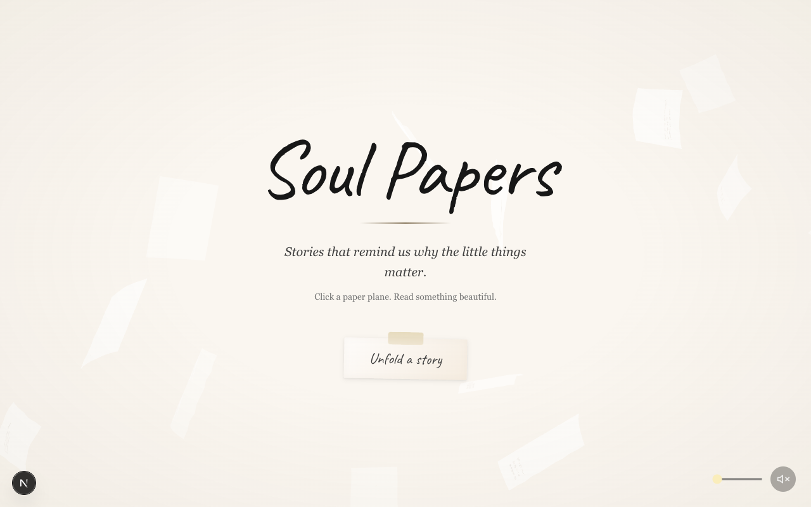
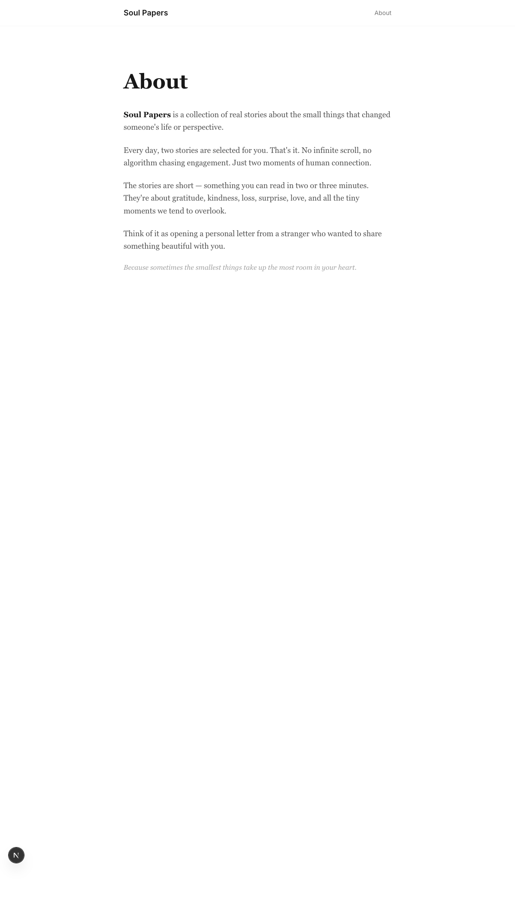

# Soul Papers ✈️

> *Stories that remind us why the little things matter.*

A contemplative reading experience — exactly **2 curated stories per day**, delivered as animated paper planes floating across a lofi-inspired scene. Click a plane, watch it unfold into a handwritten letter, read something beautiful.

No algorithm. No infinite scroll. Just two stories, daily.

[](https://nextjs.org)
[](https://typescriptlang.org)
[](https://tailwindcss.com)
[](https://gsap.com)
[](LICENSE)
[](https://soul-papers.vercel.app)

---



---

## The Idea

Soul Papers pushes back against the attention economy. Every design decision is intentional:

- **2 stories per day** — scarcity makes each one feel like a gift
- **Paper plane metaphor** — stories arrive like letters from a stranger
- **Lofi aesthetic** — warm textures, handwriting fonts, ambient audio
- **No engagement metrics** — no likes, no streaks, no notifications

New stories unlock at midnight. The ones you missed are gone until the pool resets.

---

## Screenshots

| Home | About |
|---|---|
|  |  |

---

## Features

- **Animated paper planes** — GSAP MotionPathPlugin drives curved flight paths across the scene
- **Paper letter modal** — click a plane to unfold a scrollable letter with MDX-rendered story content
- **Daily rotation** — `localStorage` tracks reads; 2 new stories unlock each midnight
- **Lofi video background** — warm ambient loop with audio toggle
- **Intro overlay** — cinematic splash screen, auto-skipped after 2 reads
- **Three.js 3D mode** — optional alternative rendering with depth and perspective
- **Accessibility** — WCAG-compliant tap targets (≥44px), reduced-motion support, semantic HTML

---

## Tech Stack

| Layer | Tech |
|---|---|
| Framework | [Next.js 16](https://nextjs.org) — App Router, static export |
| Styling | [Tailwind CSS 4](https://tailwindcss.com) |
| Animation | [GSAP 3](https://gsap.com) + MotionPathPlugin |
| 3D (optional) | [Three.js](https://threejs.org) |
| Content | [MDX](https://mdxjs.com) + [gray-matter](https://github.com/jonschlinkert/gray-matter) |
| Testing | [Vitest](https://vitest.dev) |
| Linting | [Biome](https://biomejs.dev) |
| Package manager | [pnpm](https://pnpm.io) |

---

## Getting Started

```bash
pnpm install
pnpm dev
```

Open [http://localhost:3000](http://localhost:3000).

### Other commands

```bash
pnpm build        # Production build
pnpm test         # Run tests
pnpm lint         # Lint with Biome
pnpm lint:fix     # Auto-fix lint issues
```

---

## Adding Stories

Drop a `.mdx` file in `content/stories/`:

```mdx
---
title: The Name of the Story
author: Author Name
date: 2026-01-01
tags: [memory, connection]
slug: the-name-of-the-story
---

Your story content here. Write from the heart — these are the small moments
that change everything.
```

Stories are selected randomly — 2 per day, no repeats until the pool resets.

---

## Project Structure

```
soul-papers/
├── content/
│   └── stories/              # MDX story files — add yours here
├── public/
│   ├── audio/                # Lofi ambient track
│   ├── images/               # Static assets + screenshots
│   └── video/                # Background video loop
└── src/
    ├── app/
    │   ├── (main)/
    │   │   ├── page.tsx      # Home — animated scene
    │   │   └── about/        # About page
    │   └── layout.tsx
    ├── components/
    │   ├── scene.tsx          # Main orchestrator
    │   ├── paper-plane.tsx    # GSAP-animated SVG plane
    │   ├── paper-letter.tsx   # Story letter modal
    │   ├── video-background.tsx
    │   └── audio-controls.tsx
    └── lib/
        ├── stories.ts         # File-based MDX loader
        ├── random-story.ts    # Daily 2-story picker
        └── reading-state.ts   # localStorage read tracker
```

---

## License

[MIT](LICENSE)
